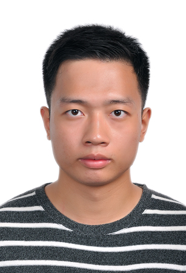

     <h1>刘戈阳</h1>
     

         
             
             18073519737
         
         ·
         
             
             keyoung.lau@outlook.com
         
         ·
         
             
             <a href="https://github.com/KeyoungLau">Keyoung</a>
         
         ·
         
             
             <a href="https://www.cnblogs.com/keyoung/">CnBlog</a>
         
     

     
 

 

##  个人信息

 - 男，1995年出生
 - 政治面貌：团员
 - 求职意向：图书馆员、信息管理岗、运维工程师
 - 期望城市：贵阳

##  教育经历

- **硕士，云南大学，图书情报专业，2018.09~至今**
  - 主修课程：信息处理技术、管理信息系统、信息组织与检索、各类型图书馆管理、数据库原理与应用
  - 研究方向：数字图书馆、知识产权分析
  
- **学士，石河子大学，经济学专业，2013.09~2017.07**
  - 主修课程：微观经济学、国际经济学、金融学、博弈论、制度经济学、计量经济学、管理学
  - 研究方向：消费金融

##  实习经历

- **云南大学图书馆（2018.12—至今） 运维开发岗**
   - 云南大学图书馆技术部实习，日常负责云南大学图书馆服务器资源的监控与管理；
   - 负责为所购数据库资源写爬虫验证程序，确保数据库资源的高可用性；
   - 负责图书馆网站的日常网络维护与数据备份；

- **中国科学院昆明动物研究所（2019.10—2020.01） 信管岗**
  - 标本库实习，负责NSII项目（http://www.nsii.org.cn/）螺类标本的数据清洗和数字化整理与表达工作；
   - 完成7000多号螺类标本的数字化清洗与整理工作并顺利验收合格；

- **昆明动物研究所动物博物馆（2019.07—2019.09） 运维岗**
   - 动物博物馆信息部实习，负责管理博物馆机房日常运维工作；
   - 负责博物馆微信公众号日常运营；
   - 协助阿里云工作人员完成标本数据库迁移工作；
   - 负责**<**昆虫库标本卡片打印软件**>**的开发与测试；

- **云南大学知识产权服务中心（2019.03—2019.12） 专利分析岗**
   - 负责专利分析与撰写专利分析报告；
   - 作为主要编写人员，编写三七稀有皂苷专利部分，有《三七产业专利分析报告》一书出版；

- **中国农业银行石河子分行（2016.05—2016.08） 信贷岗**
   - 在中国农业银行石河子分行客户部实习；
   - 负责农业小额贷款合同的电话回访、整理与数字化建档工作；

##  项目经历

- **昆虫标本卡片打印软件项目**：
  
  
为昆明动物研究所标本馆昆虫库编写了昆虫标本卡片自动打印软件。将昆虫标本数据导入到该软件中，就可以自动生成所要打印和粘贴的昆虫标本卡片格式，使用该软件清理了昆明动物研究所昆虫库十年的标本数据积压，粘贴近2000张硬纸卡。GitHub地址：KeyoungLau/py4insect-specimen。

  
- **基于高精度OCR文件处理工具**：

  
该项目源于云南大学校档案馆有两万多张毕业证和学位证照片需要重命名，重命名的依据是学位证或毕业证上的姓名和专业等信息。根据照片中的内容进行重命名，人工来做的话效率特别低，通过编写软件调用百度云高精度OCR实现自动自动重命名作业，日均可处理2000到5000张图片，准确率在98%以上，顺利完成了2019年云南大学毕业生学位证毕业证电子档案归档工作。GitHub地址：KeyoungLau/lazy4power。

##  技能证书

- ★★★ 语言：CET6证书（516）
- ★★★ Python：微软MTA Python证书、国家计算机等级二级证书（Python）
- ★★★ 运维：红帽RHCE证书、工信部高级Linux运维工程师证书
- ★☆☆ 数据库：国家计算机等级二级证书（MySQL）
- ★★☆ 网络管理：工信部高级网络工程师证书、国家计算机等级三级证书（网络技术）
- ★★☆ Office：微软MOS Master认证证书、国家计算机等级二级证书（Office）
- ★☆☆ 自动化：阿里云RPA证书

##  获得荣誉

- 获2014-2015学年石河子大学学业奖学金三等奖
- 获2018-2019学年云南大学学业奖学金三等奖
- 获2015年石河子大学经管学院羽毛球比赛男单第一名、男双第二名
- 或2015年石河子大学羽毛球混合团体赛第六名
- 获2019年昆明龙翔街道羽毛球团体赛第一名

##  自我评价

性格稳重，做事情脚踏实地，责任感强，有良好的沟通能力、较强的学习能力和抗压能力；熟悉图书馆的日常运维与管理，熟悉信息资源的建设流程，熟练掌握专利分析报告的写法；熟悉 Linux 平台和shell脚本的编写，熟悉DBM，熟悉Docker，熟练掌握Python和JavaScript编程语言，能使用Python进行应用模型的快速开发，具备优秀的英文技术文档阅读与翻译能力；爱好打羽毛球；

  
Copyright © 2020 keyoung

  
Powered By Markdown
  

